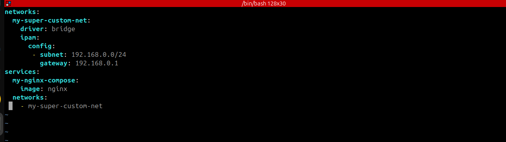
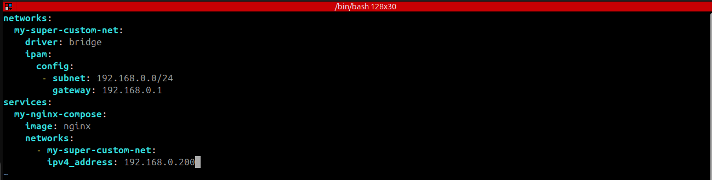
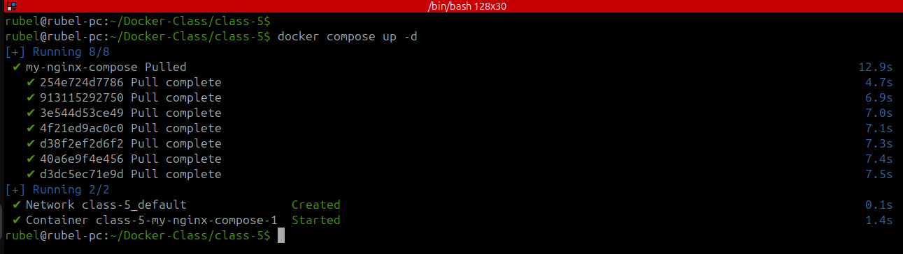
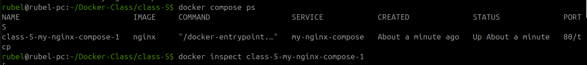
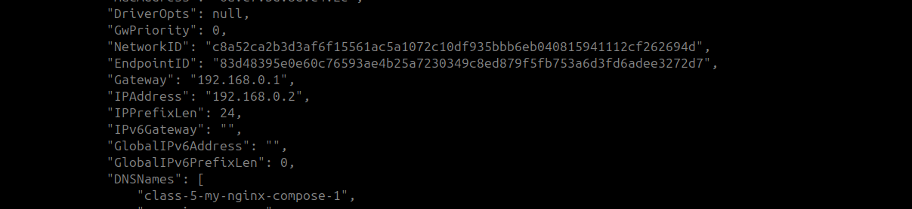

# Docker Custom Network with Static IP

A demo of Docker Compose with custom bridge networking.

---

## 🧭 Overview

This project demonstrates how to:

✔ Create a custom bridge network in Docker  
✔ Assign a static subnet & gateway using `ipam`  
✔ Deploy an **Nginx** container on the custom network

---

## 🧰 Prerequisites

- Docker (installed)
- Docker Compose (version 2+)

---

## 🚀 Usage

1. **Clone or download** the `docker-compose.yaml` file.





** Select ip in yaml file **




---

3. **Run the following command** to start the container:

    ```sh
    docker compose up -d
    ```


---

4. **Check the running containers**:

    ```sh
    docker compose ps
    ```

5. **Inspect the container’s network**:

    ```sh
    docker inspect <container_name>
    ```

    

** - Check IP**


 

** Select ip in yaml file **


---

## 🔑 Key Features

- **Custom network name:** `my-super-custom-net`  
- **Predefined subnet:** `192.168.0.0/24`  
- **Gateway:** `192.168.0.1`  
- **Service:** `nginx` attached to the custom network

---

✅ Great for learning Docker networking with static IPs!
