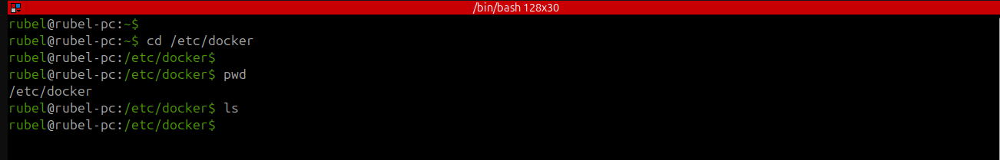
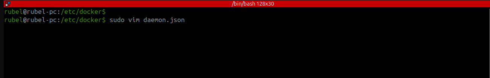
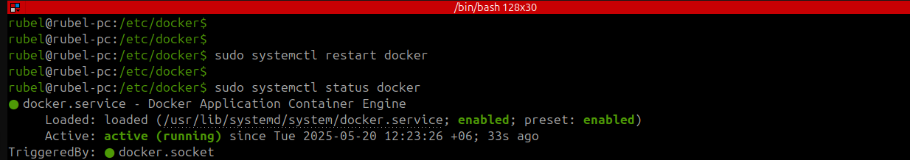

# 🛠️ Configure Custom IP Range for Docker Default Bridge Network

This document demonstrates how to configure a custom IP range for Docker’s default bridge network (`docker0`).

---

## 📂 Step 1: Access Docker Configuration Directory

  ⏩ First, navigate to Docker's configuration directory and verify your current location:

```bash
cd /etc/docker/
pwd
```



---

## ✏️ Step 2: Create or Edit the `daemon.json` File

  ⏩ Open the `daemon.json` file using `vim` or your preferred text editor:

```bash
sudo vim daemon.json
```

  ⏩ Then, add the following configuration:

```json
{
  "bip": "10.10.10.1/24"
}
```




🎯 Explanation:  
This `bip` (Bridge IP) setting assigns a custom IP subnet (`10.10.10.1` to `10.10.10.254`) for Docker’s default bridge network (`docker0`).

---

## 🔄 Step 3: Restart the Docker Service

  ⏩ Restart the Docker service to apply the changes:

```bash
sudo systemctl restart docker
```

---

## ✅ Step 4: Check Docker Status

  ⏩ Verify if Docker is running correctly:

```bash
sudo systemctl status docker
```



---

## 🔍 Step 5: Verify IP Using `ifconfig`

  ⏩ Check whether the new IP for Docker’s `docker0` bridge is correctly set:

```bash
ifconfig
```


  ⏩ The `docker0` interface should now display the IP: `10.10.10.1`

---

## 📌 Summary

  ⏩ The default Docker bridge network subnet was customized.  
  ⏩ A new IP range was defined using the `bip` configuration.  
  ⏩ Docker service was restarted to apply the changes.  
  ⏩ Network settings were verified using `ifconfig`.

---
