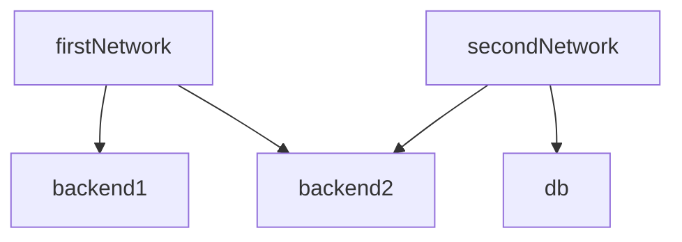
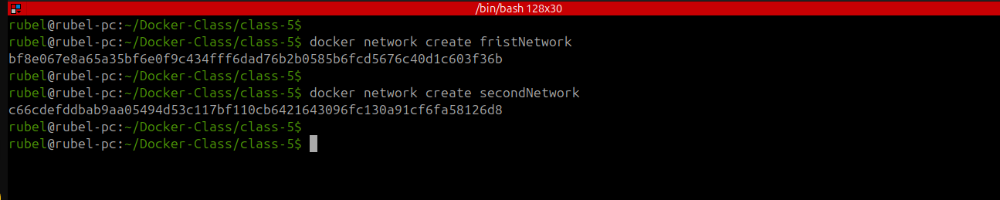
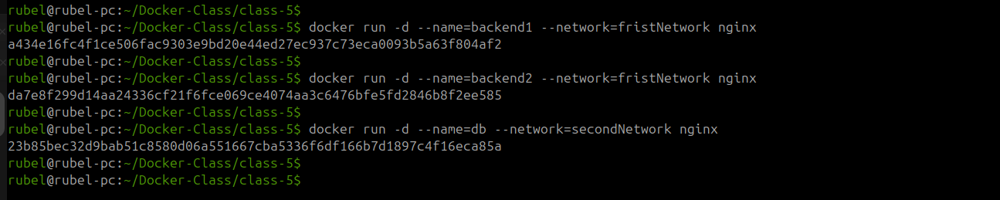
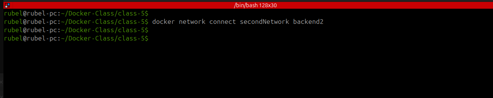
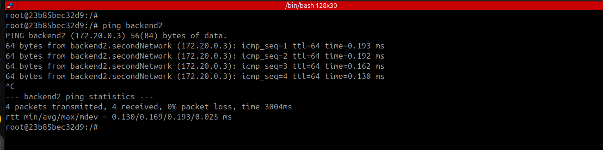
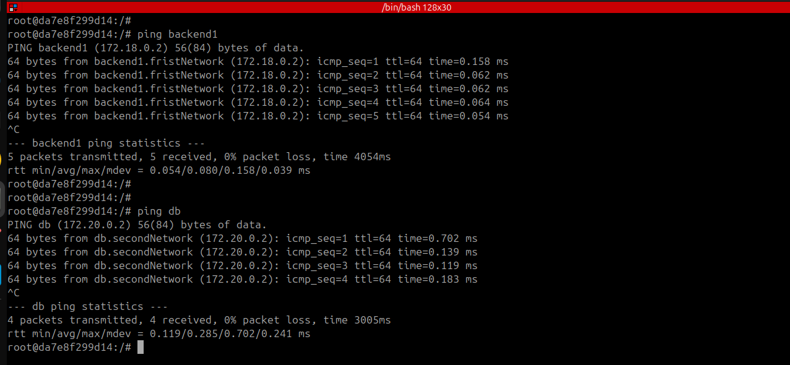
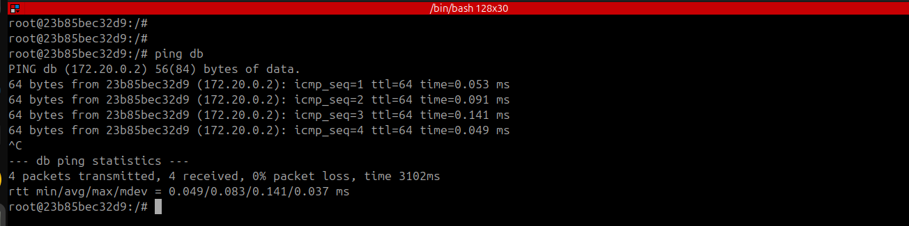

# 🌀 Docker Multi-Network Container Communication Demo

This guide demonstrates creating multiple Docker networks, attaching containers, and testing network connectivity between them.

## 🌐 Network Topology Overview
---



---


🛠️ Setup Commands

1. Create Docker Networks
 
```
docker network create firstNetwork
docker network create secondNetwork
```

---



2. Launch Containers

```
# Launch containers in firstNetwork
docker run -d --name=backend1 --network=firstNetwork nginx
docker run -d --name=backend2 --network=firstNetwork nginx

# Launch db container in secondNetwork
docker run -d --name=db --network=secondNetwork nginx

```



---

3. Connect backend2 to secondNetwork

```
docker network connect secondNetwork backend2
```


---

🔍 Verification Steps

1. Inspect Container Networks

```
docker inspect backend1
docker inspect backend2
```

---

2. Test Connectivity
  ⏺ From backend1:

```
docker exec -it backend1 bash
apt update && apt install iputils-ping -y
ping backend2  # Should succeed (same network)
ping db        # Should fail (different networks)

```



---

From backend2:

```
docker exec -it backend2 bash
apt update && apt install iputils-ping -y
ping backend1  # Should succeed (same network)
ping db        # Should succeed (connected to both networks)

```


---

From db:

```
docker exec -it db bash
apt update && apt install iputils-ping -y
ping backend2  # Should succeed
ping backend1  # Should fail

```


---

📌 Key Observations

1. Network Isolation:
  ⏺ backend1 can only communicate with backend2 (same network)

  ⏺ db can only communicate with backend2 (no direct route to backend1)

2.Multi-Homed Container:

  ⏺ backend2 can communicate with both networks as it's attached to both

3DNS Resolution:

  ⏺ Docker provides automatic DNS resolution for container names within the same network

---

🧹 Cleanup Commands

```
docker stop backend1 backend2 db
docker rm backend1 backend2 db
docker network rm firstNetwork secondNetwork
```

---
