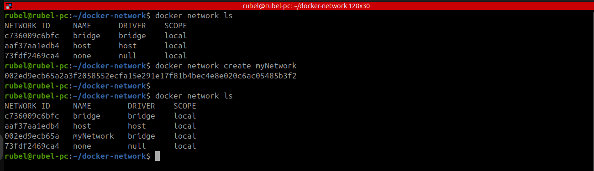
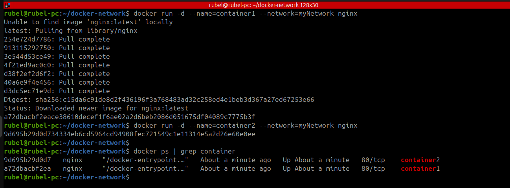
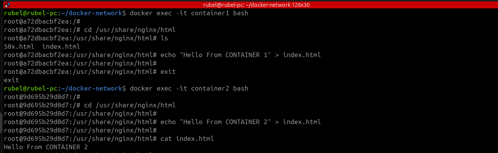
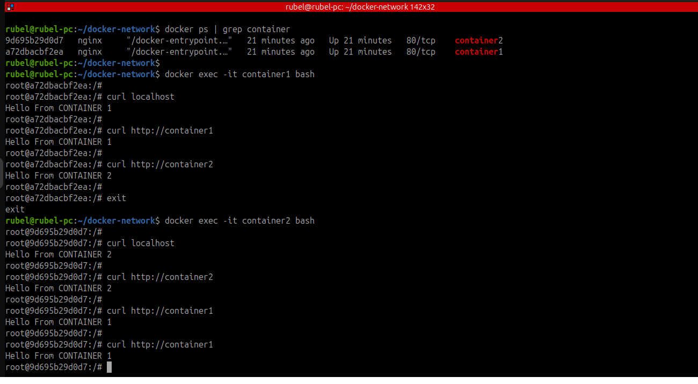

# Docker Container Communication in a Custom Bridge Network (`myNetwork`)

This guide demonstrates how two Docker containers (Nginx servers) can communicate with each other using a custom user-defined bridge network.

---

## ✩ Step 1: Create a Custom Network

```bash
docker network ls
docker network create myNetwork
```

---



## ✩ Step 2: Run Two Nginx Containers in the Same Network

```bash
docker run -d --name=container1 --network=myNetwork nginx
docker run -d --name=container2 --network=myNetwork nginx
```

---



## ✩ Step 3: Verify Running Containers

```bash
docker ps | grep container
```

---

## ✩ Step 4: Modify `index.html` in `container1`

```bash
docker exec -it container1 bash
cd /usr/share/nginx/html
ls
echo "Hello From CONTAINER 1" > index.html
exit
```

---

## ✩ Step 5: Modify `index.html` in `container2`

```bash
docker exec -it container2 bash
cd /usr/share/nginx/html
echo "Hello From CONTAINER 2" > index.html
cat index.html
```

---



## ✩ Step 6: Test Communication from `container1`

```bash
docker exec -it container1 bash
curl localhost
# Output: Hello From CONTAINER 1

curl http://container2
# Output: Hello From CONTAINER 2
exit
```

---

## ✩ Step 7: Test Communication from `container2`

```bash
docker exec -it container2 bash
curl localhost
# Output: Hello From CONTAINER 2

curl http://container1
# Output: Hello From CONTAINER 1
```

---

  ✩ OutPut



## ✨ Summary

This demonstrates that containers connected to the same user-defined Docker bridge network can communicate using container names as hostnames. Perfect for multi-container applications like microservices, load balancing, etc.


