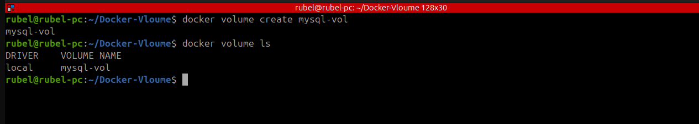
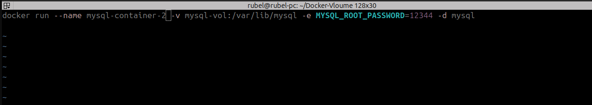
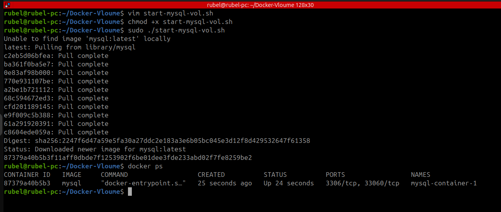
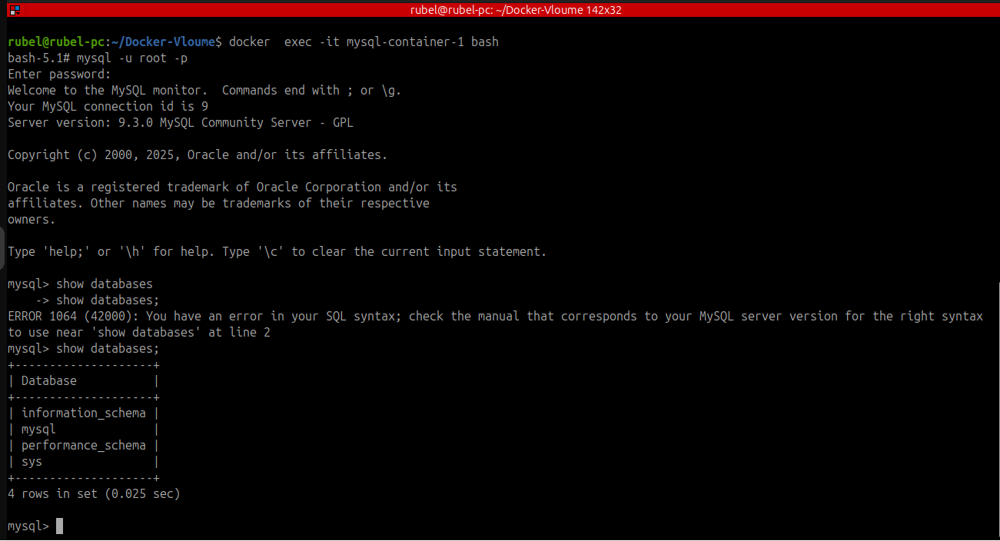
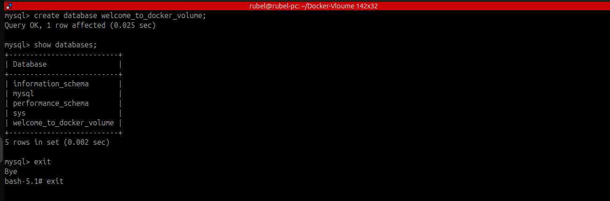
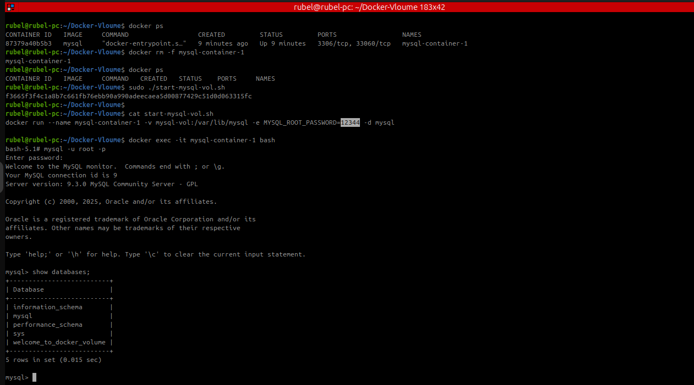

# 🐳 Persistent MySQL with Docker Volume

This project demonstrates how to run a MySQL container using a **Docker named volume** to persist database data even after the container is removed.

## 📦 What You’ll Learn

- How to create a Docker volume
- How to run a MySQL container with persistent storage
- How data remains intact after removing and restarting containers

---

## 🛠️ Step-by-Step Instructions

### 1. Create a Docker Volume

```
docker volume create mysql-vol
```


</br>

**2. Create a Shell Script to Run MySQL with Volume** </br>

  👉 Create a file called `start-mysql-vol.sh` with the following content:
```
#!/bin/bash
docker run --name mysql-container-2 \
  -v mysql-vol:/var/lib/mysql \
  -e MYSQL_ROOT_PASSWORD=12344 \
  -d mysql
```


</br>

 👉 Then make it executable:
 
```
chmod +x start-mysql-vol.sh
```


</br>

3. Run the MySQL Container
```
sudo ./start-mysql-vol.sh
```
</br>

**4. (Optional) Create a Test Database** </br>

   👉 If you had another container (`mysql-container-1`) using the same volume, you might have done:
```
docker exec -it mysql-container-1 bash
mysql -u root -p
```
 👉 Inside the MySQL prompt: </br>

```
CREATE DATABASE welcome_to_docker_volume;
```


  👉 Create Database
  


</br>

**5. Remove the Old Container (simulate restart)**
```
docker rm -f mysql-container-1
```
</br>

**6. Start Again Using the Volume**
```
sudo ./start-mysql-vol.sh
```
</br>

**7. Verify Persistence** </br>

   👉 Connect again:
```
docker exec -it mysql-container-2 bash
mysql -u root -p
```
</br>
  👉 Then:
 
```
SHOW DATABASES;
```
✅ You should see welcome_to_docker_volume — confirming that the data persisted even after container deletion.

  👉 OutPut  
  


</br>

**📁 Summary**

| Component             | Purpose                                   |
| --------------------- | ----------------------------------------- |
| `mysql-vol`           | Docker volume to persist MySQL data       |
| `start-mysql-vol.sh`  | Script to run MySQL container with volume |
| `MYSQL_ROOT_PASSWORD` | MySQL root password (12344)               |


