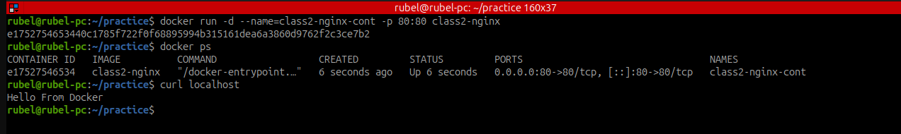

### __ধাপ ১: vim Dockerfile__

 ```
FROM nginx
COPY index.html /usr/share/nginx/html
```


ব্যাখ্যা: </br>
  এখানে একটি Dockerfile তৈরি করা হয়েছে, যেখানে:

  - `FROM nginx` — এটি বলে দিচ্ছে যে nginx অফিসিয়াল ইমেজটি বেস হিসেবে ব্যবহার করা হবে।
  `COPY index.html /usr/share/nginx/html` — এই কমান্ডটি index.html ফাইলটিকে Nginx এর ডিফল্ট
   ওয়েবরুট `/usr/share/nginx/html`-এ কপি করে দিচ্ছে। 
  এতে ব্রাউজারে গিয়ে `Nginx` এর ডিফল্ট পেজ না দেখে তোমার দেওয়া `index.html` দেখা যাবে।

### __🔹 ধাপ ২: vim index.html__

```
vim index.html
```


ব্যাখ্যা: </br>
  এটি হলো HTML ফাইল যা ব্রাউজারে প্রদর্শিত হবে যখন কেউ তোমার কনটেইনারের সার্ভারে (মানে: `localhost:80`) যাবে।


__🔹 ধাপ ৩: Docker ইমেজ তৈরি__

```
docker build . -t class02-nginx
```
ব্যাখ্যা: </br>
  এটি বর্তমান ডিরেক্টরিতে থাকা Dockerfile অনুসারে একটি ইমেজ তৈরি করে যার নাম class02-nginx।

### __🔹 ধাপ ৪: কনটেইনার রান করানো__

```
docker run -d --name=class2-nginx-container -p 80:80 class2-nginx
```

ব্যাখ্যা: </br>
   এটি `class2-nginx` ইমেজ থেকে একটি কনটেইনার চালু করে:

   `-d মানে detach mode`, কনটেইনার ব্যাকগ্রাউন্ডে চলে।

   `--name=class2-nginx-container` কনটেইনারের নাম নির্ধারণ করে।

   `-p 80:80` মানে হোস্টের 80 পোর্টটি কনটেইনারের 80 পোর্টের সাথে ম্যাপ করে, অর্থাৎ তুমি ব্রাউজারে `localhost বা server-ip এ গেলেই তোমার index.html` দেখা যাবে।




