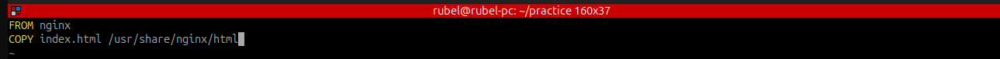

__ধাপ ১: vim Dockerfile__

 ```
FROM nginx
COPY index.html /usr/share/nginx/html
```


ব্যাখ্যা:
এখানে একটি Dockerfile তৈরি করা হয়েছে, যেখানে:

FROM nginx — এটি বলে দিচ্ছে যে nginx অফিসিয়াল ইমেজটি বেস হিসেবে ব্যবহার করা হবে।

COPY index.html /usr/share/nginx/html — এই কমান্ডটি index.html ফাইলটিকে Nginx 
এর ডিফল্ট ওয়েবরুট /usr/share/nginx/html-এ কপি করে দিচ্ছে। 
এতে ব্রাউজারে গিয়ে Nginx এর ডিফল্ট পেজ না দেখে তোমার দেওয়া index.html দেখা যাবে।


__ধাপ ১: vim index.html __


```
vim index.html
```
ব্যাখ্যা:
এটি হলো HTML ফাইল যা ব্রাউজারে প্রদর্শিত হবে যখন কেউ তোমার কনটেইনারের সার্ভারে (মানে: localhost:80) যাবে।

__ধাপ ১: vim Dockerfile__
